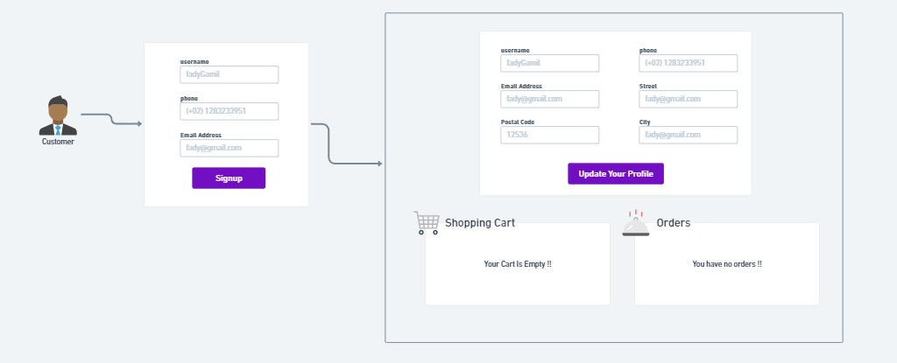
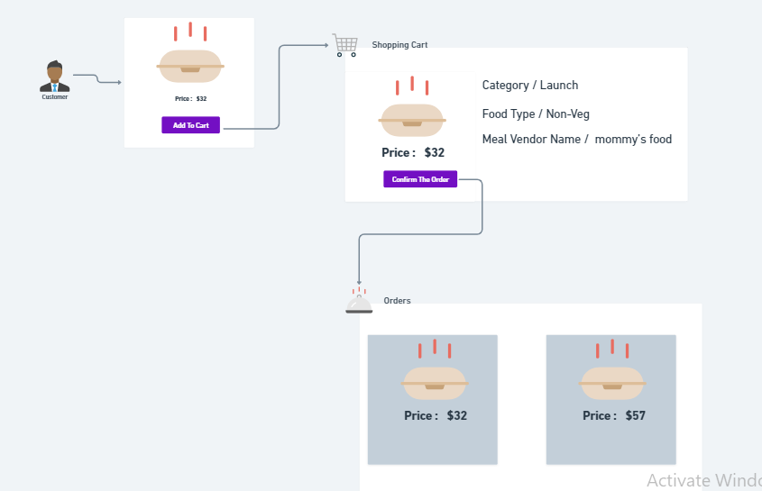

# Microservices-Food-order-app-
This is the microservices version of my previous online-food-order-app monolith backend application 

# `Customer Story`
#### ➜ The view the customer will get once the customer is registered to our app 

#### ➜ The view the customer will get once the customer clicked on any meal  
